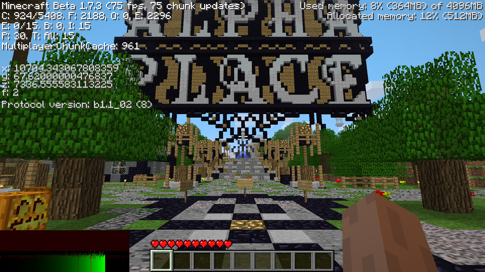
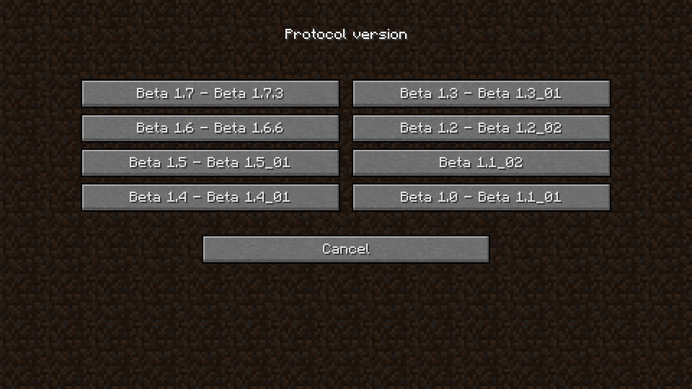
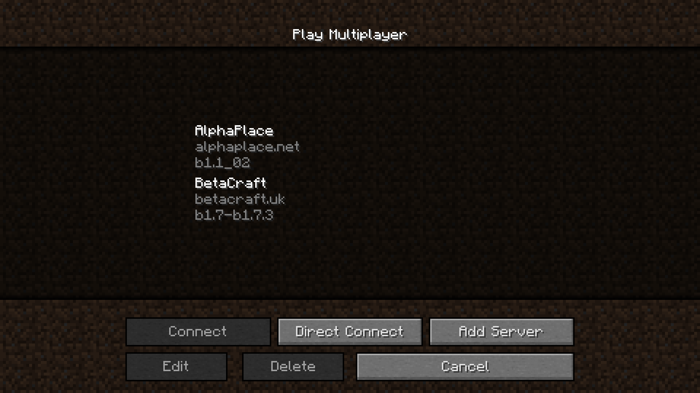
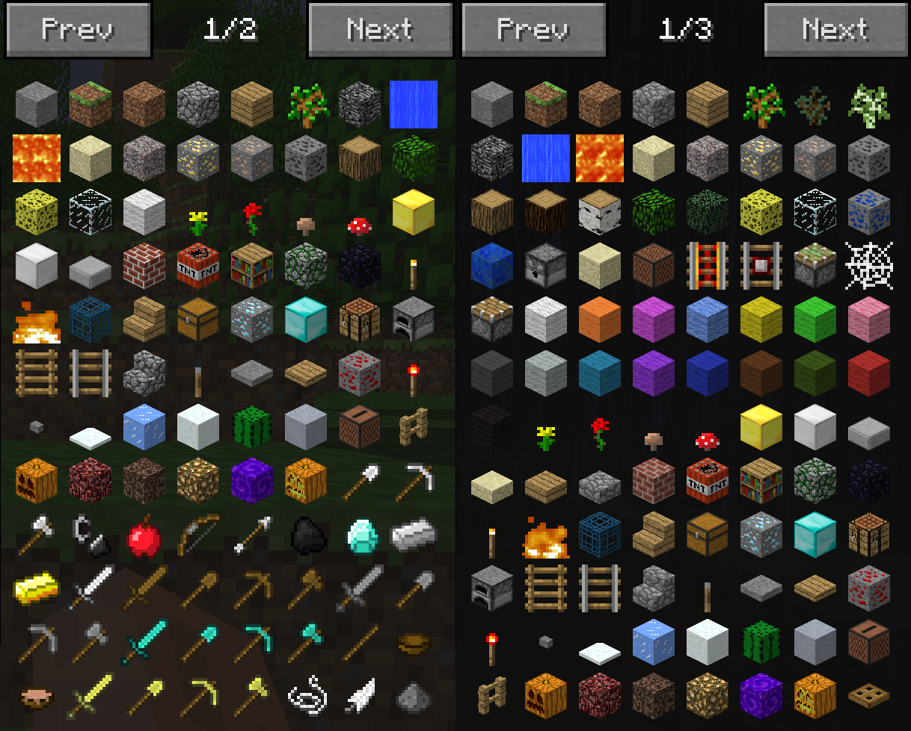

#  Multiproto

Screenshot taken on [AlphaPlace](https://alphaplace.net)

### Requirements

- [Babric](https://babric.github.io/)
- [StationAPI](https://modrinth.com/mod/stationapi)
- [Glass Config API](https://modrinth.com/mod/glass-config-api)
- [ModMenu Beta](https://modrinth.com/mod/modmenu-beta) (Required for in-game config)
- [MojangFixStationAPI](https://modrinth.com/mod/mojangfix-stationapi-edition) (Optional)
- [HowManyItems Fabric](https://modrinth.com/mod/howmanyitems-fabric) (Optional)

MojangFixStationAPI integration

HowManyItems Fabric integration
