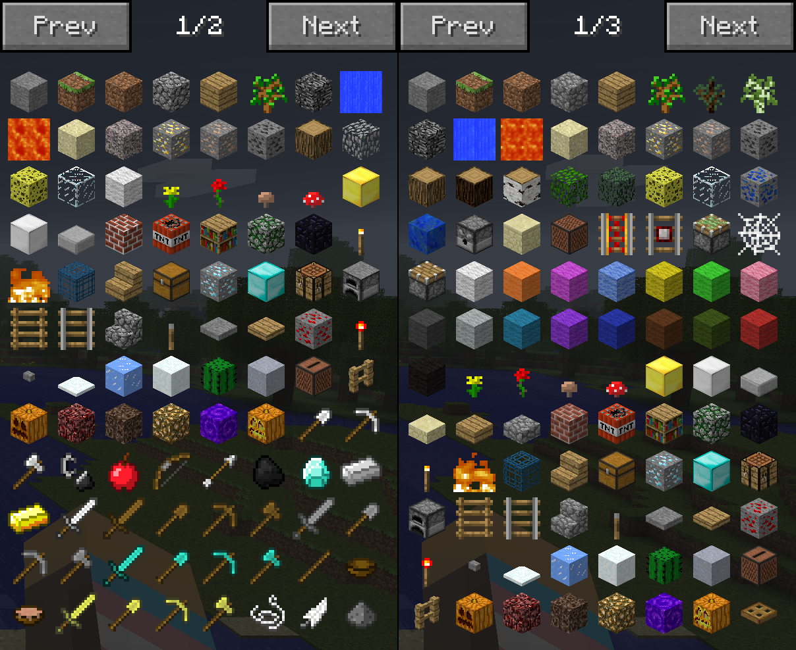

#  Multiproto

Screenshot taken on [AlphaPlace](https://alphaplace.net)

### Requirements
1. [Babric](https://babric.github.io/)
2. [StationAPI](https://modrinth.com/mod/stationapi)
3. [ModMenu Beta](https://modrinth.com/mod/modmenu-beta)
4. [Glass Config API](https://modrinth.com/mod/glass-config-api)
5. [MojangFixStationAPI](https://modrinth.com/mod/mojangfix-stationapi-edition) (Optional)
6. [HowManyItems Fabric](https://modrinth.com/mod/howmanyitems-fabric) (Optional)

MojangFixStationAPI integration

HowManyItems Fabric integration
